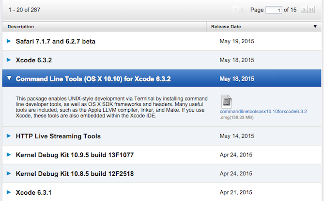

##Introduction
Welcome to the first meetup topic Environment Setup. The following post will outline the steps for installation of the tools needed to run our [Environment Code](https://github.com/SeattleLadiesJS/Environment-Setup){:target="_blank"}. Ideally you will have ran through all the steps and have all the tools installed before the meetup. If you run into problems getting these items installed I encourage joining our [slack](https://seattleladiesjs.slack.com/){:target="_blank"} group and posting your questions to the "#environment-setup" channel. If you need an invite to our slack group please send your name and email address to [seattleladiesjs@gmail.com](mailto:seattleladiesjs@gmail.com). 

##Operating System

First best thing to have is an up to date version of OSX on your Mac, today that is v10.10.3 Yosemite. If your Mac can run Mavericks it can run Yosemite, [update instructions here](https://www.apple.com/support/osx/upgrade/){:target="_blank"}. 

##Code Editor

Next thing we need is a code editor, it can be any code editor that you prefer but I will be using SublimeText3 and would recommend it as a nice simple to use code editor, [download here](http://www.sublimetext.com/3){:target="_blank"}.

Our environment setup is using an [EditorConfig](http://editorconfig.org/){:target="_blank"} which helps maintain consistency of coding styles across different types of editors and IDEs, if you are using an editor other than SublimeText3 there should be a plugin available, you would have to research your editor to find plugin install instructions. 

For installing EditorConfig with SublimeText3 you have to use the Package Manager which is a plugin for SublimeText3 that needs to be installed separately, [instructions on how to install here](https://packagecontrol.io/installation){:target="_blank"}. Once you have Package Manager installed you can add packages to customize SublimeText3 to suite your development style. 

Package Control is driven by the Command Palette, to open the palette, press `cmd+shift+p`.  A drop down should appear start typing "Package Control: Install Package" until the menu option appears, select it and hit enter. A new drop down will appear then type in the name of the package you would like to install, in this case type 'EditorConfig', select it and hit enter. You can see the package install progress in the bottom left corner of SublimeText. When it has finished you must restart SublimeText for it to be activated.

There are lots of great packages for SublimeText that you can install to customize your environment, none of them are required but there are a few that I use and recommend below.

- [Emmet](http://emmet.io/){:target="_blank"} - HTML snippets.
- [SublimeLinter](http://sublimelinter.readthedocs.org/en/latest/index.html){:target="_blank"} A plugin for Sublime which allows you to add packages for linting your code.
  - [SublimeLinter-html-tidy](https://github.com/SublimeLinter/SublimeLinter-html-tidy){:target="_blank"}
  - [SublimeLinter-csslint](https://github.com/SublimeLinter/SublimeLinter-csslint){:target="_blank"}
  - [SublimeLinter-jshint]( https://github.com/SublimeLinter/SublimeLinter-jshint){:target="_blank"}
- [JavaScript Snippets](https://github.com/jprichardson/sublime-js-snippets){:target="_blank"} - Snippets for JavaScript.
- [Local History](https://github.com/vishr/local-history){:target="_blank"} - Maintains a local history of files.
- [Sass](https://github.com/nathos/sass-textmate-bundle){:target="_blank"} - Snippets and highlighting for sass.
- [DocBlockr](https://github.com/Warin/Sublime/tree/master/DocBlockr){:target="_blank"} - Assists in writing comment blocks.
- [AlignTab](https://github.com/randy3k/AlignTab){:target="_blank"} - Assists in code alignment.

##Git

Before we are ready to start working with code we need to have a system in place to manage that code, we'll be using Git. If you have never heard of Git before I would suggest reading [GitHub For Beginners: Don't Get Scared, Get Started](http://readwrite.com/2013/09/30/understanding-github-a-journey-for-beginners-part-1){:target="_blank"}. Another great read for all levels of experience is [Getting Started Git Basics](https://git-scm.com/book/en/v2/Getting-Started-Git-Basics){:target="_blank"}.  

Git is the most popular code repository and version control system in open source and it can have some very technical aspects to it, but for now let's focus on getting it installed. Git is available on Mac through Xcode Command Line Tools. XCode is "The complete toolkit for building great apps" but it is large and the entire toolkit isn't needed, so we will be downloading only what we need from the [Apple Developer Site](https://idmsa.apple.com/IDMSWebAuth/login?&appIdKey=891bd3417a7776362562d2197f89480a8547b108fd934911bcbea0110d07f757&path=%2F%2Fdownloads%2Findex.action){:target="_blank"}.

After logging in choose to download the most recent version of Command Line Tools. Download and Install.

Now that you have Git installed let's go git some code. 

Open the Terminal Application and type `pwd` and hit enter to "print working directory" and tell you where your command line is operating from inside your system files. Hopefully you are in your User home directory, `/Users/<username>`, if not you can "change directory" by typing `cd "${HOME}"` and hit enter.

Type `git clone https://github.com/SeattleLadiesJS/Environment-Setup.git` and hit enter. If everything is setup correctly you should now see a new folder created in your User home called "Environment-Setup" which includes the code files that we will be using for our Environment Setup

*Note For meetup we will be forking this repository into your own git repository which means that you'll need to have a github account, be sure to have signed up for your own account at [github.com](https://github.com/){:target="_blank"} before the meetup if you don't already have an one.

##Node.js

Last step to getting our Environment running is to install Node.js, which is a runtime environment for JavaScript. If you're not familiar with Node.js I would suggest watching [What is Node.js Exactly? - a beginners introduction to Nodejs](https://www.youtube.com/watch?v=pU9Q6oiQNd0){:target="_blank"}.

You can install Node by downloading a `.dmg` installer but there is a better way, on Mac we can use [HomeBrew Package Manager](http://computers.tutsplus.com/tutorials/homebrew-demystified-os-xs-ultimate-package-manager--mac-44884){:target="_blank"} to manage our node and npm installs and there are two main reasons why:

1. It makes setting up your system permissions easier, you don't have to use `sudo` to run npm because Homebrew will place packages in areas that it can access to execute.
2. It makes updates and uninstalling very easy compared to manually searching through your file system to delete files.

If you already have Node on your Mac and you are having issues with permissions and are having to use `sudo` when installing and running some packages you may want to delete your old install of Node and follow along with Homebrew Instructions below. [How to delete your old install of Node](/notes/how-to-remove-node-from-mac.html).

Go to [Homebrew homepage](http://brew.sh/){:target="_blank"} and copy the line of ruby code below the title "Install Homebrew" and paste that into your Terminal and hit enter to install.

If you already have Homebrew you are going to want to [get brew ready to brew](/notes/get-brew-ready-to-brew.html) first and come back.

As great as Homebrew is it still isn't perfect and has had some serious [issues reported](https://gist.github.com/DanHerbert/9520689){:target="_blank"} with Node and NPM installations so we are going to taking some extra steps when installing Node with Homebrew to ensure that we never run into any of these problems. The following steps were copied directly from John Papa's blog post [How to use npm global without sudo on OSX](http://www.johnpapa.net/how-to-use-npm-global-without-sudo-on-osx/){:target="_blank"}

1. This adds node, sans npm

    `brew install node --without-npm`

2. Create a directory for your global packages. I prefer to name my folder `.npm-packages`, you can choose what you want as long as you replace it throughout these steps. The `${HOME}` is a variable that translates to `~/` or `/Users/john/` for me.

    `mkdir "${HOME}/.npm-packages"`

3. Reference this directory for future usage in your `.bashrc` file. The `echo` command helps write the statement. The `>>` tells it where to write it which is followed by the file to write it to.

      `echo NPM_PACKAGES="${HOME}/.npm-packages" >> ${HOME}/.bashrc`

4. Indicate to npm where to store your globally installed package, in your `~/.npmrc` file.

    `echo prefix=${HOME}/.npm-packages >> ${HOME}/.npmrc`

5. This gets and installs the latest npm, which is 2.1.16 at the time of this writing.

    `curl -L https://www.npmjs.org/install.sh | sh`

6. Ensure node will find the packages by adding the path to your `.bashrc`. Notice the escape characters before special characters.

    `echo NODE_PATH=\"\$NPM_PACKAGES/lib/node_modules\:\$NODE_PATH\" >> ${HOME}/.bashrc`

7. Ensure you’ll find installed binaries by adding the following to your `.bashrc`.

    `echo PATH=\"\$NPM_PACKAGES/bin\:\$PATH\" >> ${HOME}/.bashrc`

8. Ensure that you source your `.bashrc` file by adding the following to your 

    `.bash_profile`.`echo source "~/.bashrc" >> ${HOME}/.bash_profile`

9. [Source](http://tldp.org/HOWTO/Bash-Prompt-HOWTO/x237.html){:target="_blank"} your `.bashrc` file once. Previous step did this for the future, but this does it right away.
  
    `echo source "~/.bashrc" >> ${HOME}/.bash_profile`

Let's test to make sure we have everything installed correctly. In Terminal type `node -v` hit enter, you should see v0.12.4 the current version of Node.js. Now let's test that you have Node's package manager installed as well by typing `npm -v` and hit enter you should see 2.10.1.

Before we an run our Environment Setup project we need to get a couple of frontend tools installed, [gulp](http://gulpjs.com/){:target="_blank"} and [bower](http://bower.io/){:target="_blank"}. 

  Type `npm install -g gulp bower` in the Terminal and hit enter. 

Almost ready to run our project, we still have a few more things to install.

  Type `cd "${HOME}/Environment-Setup"` and hit enter

Now we can install all the required modules we'll need from NPM and Git:

Type `npm install` and hit enter 

Type `bower install` and hit enter. 

Lastly type `gulp` and hit enter, you should see output which is similar to a help menu for command line which lists the config file for the project followed by Main Tasks and Sub Tasks.

##Conclusion

I know we just blew through a lot of important stuff without much explanation but hopefully everything installed smoothly and we can spend our time in the meetup answering questions and learning about the code that is included with the sample repository. 

