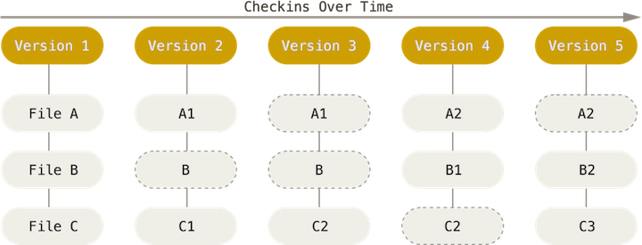
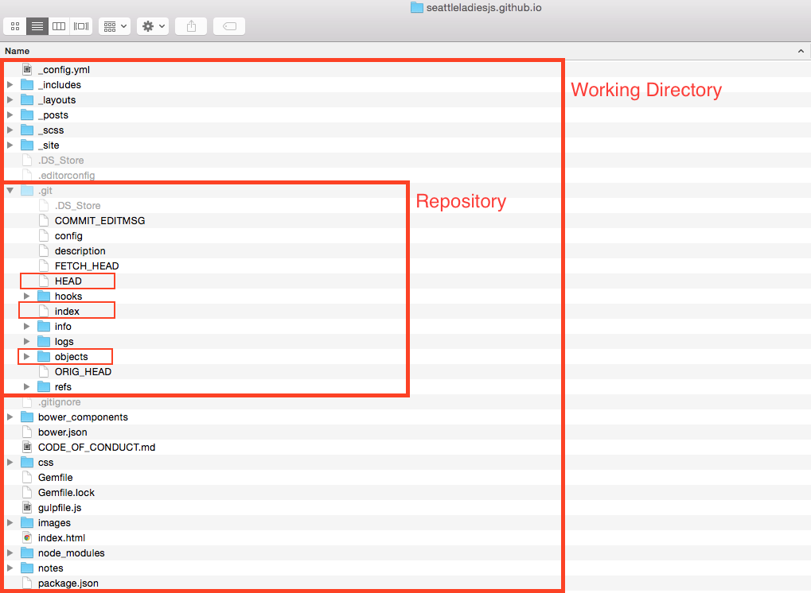
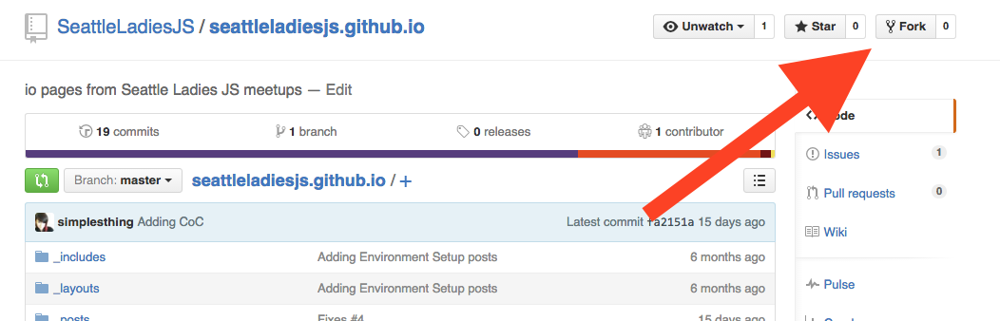
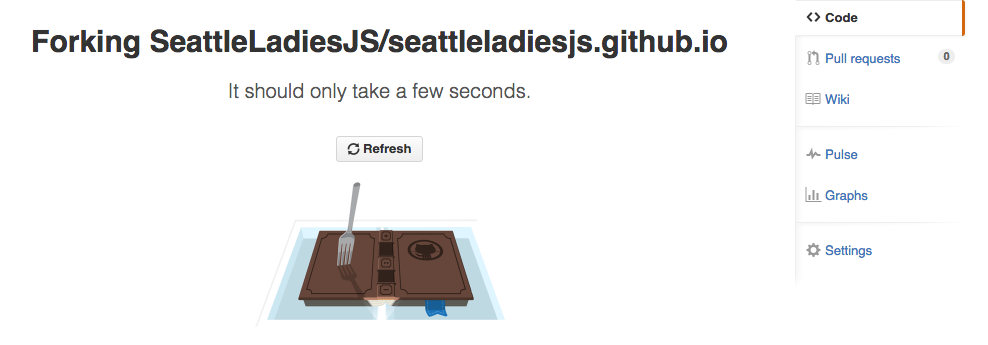
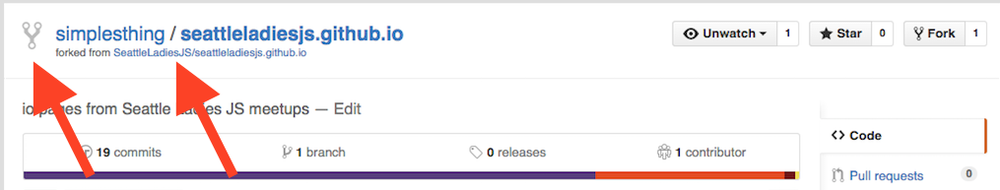
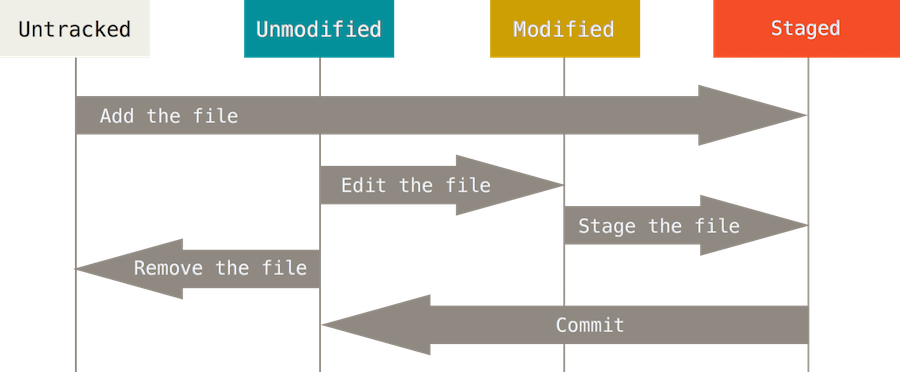
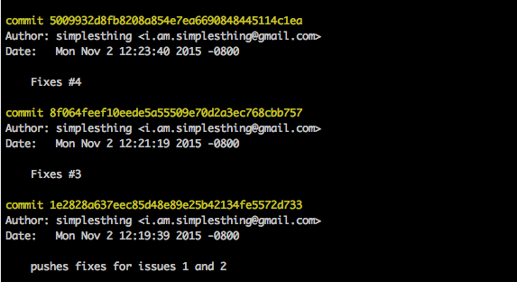
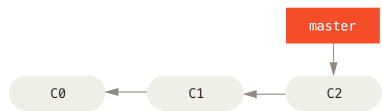
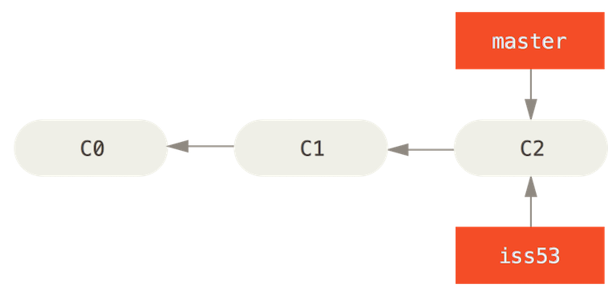

##What is Git?
 Git is Source Control Managment, also called Version Control Software, for storing source files in locations called Repositories. These systems back up files in a way that makes it easy to view files and track changes made over time. Git allows teams of developers, designers and project managers the ability to work on the same group of files without overwriting each other's work. Git also provides a way to "roll-back" code files to a specific point in history for debugging or simply tracking specific changes. 

 Git is different from other types of source control management in a few ways but the most significant is the way it thinks about data. Most systems think about their data as list of files, each having their own list of changes to a base version of an individual file.

 <figure>
  
  <figcaption>Source <a href="https://git-scm.com/book/en/v2/Getting-Started-Git-Basics">https://git-scm.com/book/en/v2/Getting-Started-Git-Basics</a></figcaption>  
 </figure>
  

Git instead thinks about its data as a set of snapshots of a mini file system. Everytime you save the state of your project in Git, called a commit, it takes a picture of what all of your files look like at that moment, called a snapshot, and stores a reference to that moment in time of the entire mini file system. Git thinks about it's data like a **stream of snapshots** rather than individual file changes. This means that at any time you can recall the state of an entire project, or just a few files, by recalling a snapshot, versus calling individual file changes.

<figure>
   
    <figcaption>Source <a href="https://git-scm.com/book/en/v2/Getting-Started-Git-Basics">https://git-scm.com/book/en/v2/Getting-Started-Git-Basics</a></figcaption>  
</figure>
 

Another important difference is that Git is distributed which means that everyone working on a project has their own full copy of the code on their own machine. Because of this most operations seem instantaneous since you have the history on your own machine Git doesn't have to connect to a network to look up file changes. This also means that you can safely work offline, commit changes locally and you can upload your changes at a later time.

Git also has the advantage of Github which provides a central place to store code for free and to manage issues, they even provide GUI tools to work with repositories, however we will be using the command line. The command line has advantages of being scripted into build systems to trigger tasks to be run upon each commit, for instance run tests or deploy new code to a live web server.

##Git Concepts  

###Repository
To understand what a repository is let's first define a term called "Working Directory". Working Directory is the directory which contains all uncompressed project files and assets along with a hidden directory named `.git`. That hidden directory *is* the repository.

<figure>
   
</figure>
 

###Objects
Git is essentially a [key value store database](https://en.wikipedia.org/wiki/Key-value_database) that compresses and stores snapshots of the working directory in Git Objects. Objects are referenced by a 40 digit hash called [SHA1](https://en.wikipedia.org/wiki/SHA-1) (Secure Hash Algorithm 1) which is the key and the value of the object consists of a **type**, a **size** and **content**. There are four different types of objects which are used to store content.

 **blob** - Used to store file data. 

  **tree** - A tree structure that references other trees or blobs.

  **commit** - Points to a top level tree which references what the working directory looked like at a certain point in time, and contains meta information about the commit.

 **tag** - A way to mark a commit in a special way, such as releases canidates.

Putting it all together a commit can be visualized as something like this.
<figure>
   
    <figcaption>Source <a href="http://schacon.github.io/gitbook/1_the_git_object_model.html">http://schacon.github.io/gitbook/1_the_git_object_model.html</a></figcaption>  
</figure>
 

###Index
The index file, also known as the "Staging Area", is where changes to the working directory are collected between commits. When you make a commit all of the changes added to the index (staging area) will be included in the snapshot of the working directory at the point in time that the commit was made. If files were not added to the index (staging area) a reference to the files in the last committed state they were in will be included in the snapshot regardless if they have changes in the working directory or not.

###HEAD
The HEAD file is symbolic reference or pointer to the SHA1 hash to that points to the branch and commit that you are working on. We won't go into much detail about the different types of references that Git uses but you can read more in the [official documentation](https://git-scm.com/book/en/v2/Git-Internals-Git-References) if you wanted to know more.

<figure>
   
    <figcaption>Source <a href="http://rogerdudler.github.io/git-guide/">http://rogerdudler.github.io/git-guide/</a></figcaption>  
</figure>
 

##Installing
Installing Git can be done in a few different ways depending on your platform. SLJS has covered a couple of ways to  install Git in a previous post called Environment Setup, Mac installation can be found [here](http://seattleladiesjs.github.io/environment-setup-mac/#git) and Windows installation can be found [here](http://seattleladiesjs.github.io/environment-setup-pc/#git). Of course these are not the only ways to install Git and with some Googling many other ways can be found that would be just as good while have some differences or advantages for certain users depending on your preferences.

There are a variety of GUI tools for using Git but we will only be using the command line. The command line is the only way that you can run all the Git commands, whereas most GUIs only implement a subset of functionality. If you know how to use the command line you will be able to figure out any GUI, but the opposite of that is not likely true.

###Configuring Git
Git comes with a tool called `git config` that lets you set configuration variables that control how Git operates. Git configurations can be set at three levels of specification where each level overrides the previous one. ([Note](https://git-scm.com/book/en/v2/Getting-Started-First-Time-Git-Setup) Windows systems may save files in different directories from what is below depending on your installation)

1. **Global** - Found at `/etc/gitconfig` sets values for every user of a a given operating system and is modified using the `--system` flag in the command line.
2. **User** - Found at `~/.gitconfig` or `~/.config/git/config` sets values specific to your user on an operating system and is modified using `--global` flag in the command line.
3. **Repository** - Found in `.git/config` and is specific for only the repository that the `.git` directory is inside of and is modified by opening that file in your choice of editor.

At the very least you should configure your Username and Email at the user level to let Git know who is working on the repository each time you make a commit. This is easily done by issuing the following two commands:

`git config --global user.name "Your Name"`

`git config --global user.email "youremail@name.domain"`

You can verify your settings by issuing the `git config --list` command, or check individual settings by issuing `git config <key>` i.e. `git config user.name` for username value. There are other configurations that can be made using the `git config` tool which you can read more about in the [official documentation](https://git-scm.com/docs/git-config).

##Getting a Git Repository
There are two ways of getting a git repository.

1. Import a project into Git from an existing directory
2. Export a project out of Git from an existing repository

###Initializing a new Repository
You can initialize a new git repository inside an existing working directory of files, or empty directory for a new project, by navigating in your command line to the project directory root and issuing the command `git init`. You should see a confirmation message that starts off `Initialized empty Git repository in ...` telling you that it is done. 

If you `ls -a` in that directory you should see that Git has added a new hidden subdirectory named `.git`. If you change directories by issuing `cd .git` and the another `ls` command you can see the files and directories that have been added.

###Cloning an existing Repository
If you want to get a copy of an existing project registered in a Git Server that you have access to, most likely public GitHub servers, onto your computer you can issue `git clone [url]`. This will create a directory for the project by the nameof the project, or alternatively you can name the directory by add name after url `git clone [url [directory_name]`, install a Git repository directory and then check out a working copy of the latest version.

The cloning url can be found on GitHub on the lower right column of the page and can be copied to the clipboard by clicking the button next to the url for command lines that support copy and paste. There are also buttons to have GitHub clone to your Desktop for you or to simply Download a .zip file of the project in a location of your choice and extract it.

###Forking
GutHub offers a way of copying a repository to your GitHub profile as a starting point for you to make changes to another persons project. This is done by clicking on the Fork button on the top right corner of an existing repository page.

Once you click that button GitHub will do it's thing.

You should then be redirected to your fresh forked copy of the existing repository under your own profile on GitHub. Notice the repository will have an icon indicating that the repository was forked along with a caption below the name of the repository linking to the repository which your repository was derived.

From there you can clone the project into your workspace and make changes. Forking is most commonly used when developers want to submit bug fixes or additional code to an existing project by opening up a "pull request" for the project owner to *pull* the changes into the original product repository (more on that later).

##Committing
All files in the working directory can be in one of two base states, **tracked** or **untracked**. Tracked files are the only files that can be committed to the repository because tracked files are files that have been added to the index (staging area) at some point in the lifetime of the repository.

Furthermore tracked files  have three states to them, **unmodified**, **modified** and **staged** for keeping track of the changes made to them. When you have freshly cloned a repository all the files will be in a tracked unmodified state, if you make a change to any file that file changes to the tracked modified state, and when you commit add a file they change into the tracked staged state.

Untracked files are files that have never been added to the index (staging area) before and so Git is unaware of them. When you initialize a new repository in an existing directory this is the state in which your existing files will be, likewise whenever you add new files to a working directory those files will continue to remain untracked by Git until you add them to the index.

<figure>
   
    <figcaption>Source <a href="https://git-scm.com/book/en/v2/Git-Basics-Recording-Changes-to-the-Repository">https://git-scm.com/book/en/v2/Git-Basics-Recording-Changes-to-the-Repository</a></figcaption>  
</figure>
 

###Status
If you'd like to see that state in which your working directory is at any time you can issue `git status` to see if you have untracked files and/or tracked files with changes waiting to be added to the staging area and committed.

###Adding Files
Regardless whether files are tracked or untracked all files must first be added to the staging area before committing using the command `git add [path_to_file] [flag]`. You can add individual files by path, in reference to the root of the project, such as `git add /Users/avac/myRepo/index.html` or if you wanted to add all files, tracked or untracked, at once you can skip the path and just use  the flag for all files `git add --all`.

###Commit
Once files have been adding to staging area you might want to review your tracked changes before committing by issuing `git status` once again to verify all the changes you want to be added are included. If you have added file that you don't want to have added you can reset those files, in other words move them out of the staging area, by issuing `git reset [path_to_file]`. If for some reason you want to reset all the files in staging area to the last commit you can issue `git reset` and it will move all the files back into an untracked or untracked and modified state.

When you are ready to commit them to the repository you would issue `git commit -m "initial commit comment"`. The `-m` flag is required for adding a message to the commit object.

##File Management

###Ignoring Files
Working with JavaScript and Git you will most likely be adding packages or modules to your project using [NPM](https://www.npmjs.com/) or [Bower](http://bower.io/). When you do this you should be saving the list of which dependencies you have installed in a config file so that you can re-install them at anytime using this config. Since these packages are dependencies of your project, and possibly large in size, you probably don't want to save their source code in your repository but you do want to save the config file. Git makes this easy to do using a config file the root of your project telling Git which files and directories to ignore.

Create a file and save it as `.gitignore`. Inside that file you can add comments, paths to files and directories using "Glob Patterns" which are simplified regular expressions for the file system to parse.

- `*` An asterisk matches zero or more characters
- `images/**/kittens` Two asterisks match nested directories; i.e. would match *images/retina/kittens* and *images/mobile/kittens*
- `[abc]` Square brackets match anything inside them; i.e. *a, b or c*
- `[0-9]` Squre brackets with a hyphen match anything in between them; i.e. *0,1,2,3,4,5,6,7,8 or 9*

The rules for patterns you can use are

- Blank lines or line starting `#` are ignored
- Standard glob patterns work
- You can start patterns with `/` to avoid resistivity
- You can end patterns with `/`to specify a directory
- You can negate patterns by starting `!`

###Removing Files
Often times you will refactor and decide that you want to remove some files from a project and you'd like Git to stop tracking them. To do this you can issue `git rm [path_to_file]` and they will be staged for removal on your next commit.

###Moving Files
Likewise during a refactor you might decide to move a file to different location and you want Git to stop tracking that file from the old directory and start tracking it in the new one. You might think that Git automatically knows that a file has been moved and would update it's snapshot accordingly, but you'd be wrong. Moving files requires you to issue `git mv [from_path_to_file] [to_path_to_file]`, this is the same as running `git rm [path_to_file]` followed by `git add [path_to_file]`.

###Stashing Files

##Logging
There are many times during development that you will need to view a log of commits that have been made to a project over time. Git provides a powerful tool called `git log`. By default the logger will list the commits made in that repository in reverse chronological order with information about the commit. 

Looking at a simple `git log` we get the SHA1 hash pointing to the commit object which defines the snapshot of the code at the time of commit the author's name and email, the date the commit was made and a commit message.

This output will continue until the initial commit information is reached and you may need to paginate the results multiple times to view it all, which makes it difficult to get a broad overview of all the commits made in a repository history, when you have reached the end you will need to issue `ctrl+z` to exit the log viewer. To shorten this we can use the flag `git log --oneline` to show commits on a single line, allowing more history to be shown on a single page of results. 

You will notice that you are no longer getting a 40 digit hash but a much shorter abbreviated commit hash and you are not getting the name of the author or date but you still get the message. If you'd like to see more information you can use the `git --pretty=format:"[options]"` format. There are many possible options that can be used with the pretty flag which you can use to construct the log to display exactly which information you are interested in. Some common options are shown below.

- `H%` Full commit hash
- `h%` Abbreviated commit hash
- `%an` Author name
- `%ad` Author date (format respects the --date=option)
- `%s` Subject

In addition to formatting options you can limit the number of results shown by using limiting options such as `git log -5` to show only the previous five commits. You can use date objects, such as `2015-11-01`, to specify time ranges or use relative dates such as `10 days ago` along with the `--since`,`--after`, `--until`, and `--before` flags. 
For example to *see all commits after August 1, 2015* you could issue `git log --after=2015-08-01`. 

If you are searching for commits that contain a specific string inside a commit message you would use the `git log --grep="[string_to_match]"`. Or if you are only looking for commits made by a certain user you can use `git log --author="[author]"`.

 All of the available flags and options can be combined to get exactly what you want from the log, for example *all commits made by user "simplesthing" after August 1, 2015 with the word "fix" in the commit message formatted as the just abbreviated commit hash, the date and the message* would look like this `git log --author="simplesthing" --after=2015-08-01 --grep="fix" --pretty=format:"%h %ad %s"`.

There are a huge number of options available for `git log` that we didn't cover and if you'd like to learn more you can refer to the [official documentation](https://git-scm.com/docs/git-log).

##Branches
A branch is a tree structure of commits with pointers, all pointing backward to their ancestor, until reaching the initial commit. The main line from initial commit to current HEAD is called the **master** branch. 

<figure>
   
    <figcaption>Source <a href="https://git-scm.com/book/en/v2/Git-Branching-Basic-Branching-and-Merging">https://git-scm.com/book/en/v2/Git-Branching-Basic-Branching-and-Merging</a></figcaption>  
</figure>
 

Branches take a snapshot of the current working directory and create a copy for you to make changes to without affecting the original branch snapshot. You can create branches at anytime from any point to start making changes to a snapshot of the starting point that you want to branch off of. You can create a new branch using `git branch [name_of_branch]`. Now you created the new branch but you are not yet pointing at it in your `HEAD`. When you want to switch branches you use `git checkout [name_of_branch]`.

Before you can do that you should make sure that any files in your working directory are committed or stashed before trying to switch branches, best practice is to have a clean working directory when you switch branches. 

Once you are in the new branch you can switch back and forth between the new branch and the master using the `git checkout master` alternately with `git checkout [name_of_branch]` . 

<figure>
   
    <figcaption>Source <a href="https://git-scm.com/book/en/v2/Git-Branching-Basic-Branching-and-Merging">https://git-scm.com/book/en/v2/Git-Branching-Basic-Branching-and-Merging</a></figcaption>  
</figure>
 

##Merging
After you have made some changes to a branch and you want to move them back into the ancestor branch you should make sure the working directory is clean and checkout the ancestor branch folowed by `git merge [name_of_branch_to_merge]`. This will merge a snapshot of the branch back into the most the recent snapshot of your working directory, in this case its `master`. If your branch commit is not a direct ancestor of the latest commit on the branch you are merging into Git has to look backward to find the common ancestor commit.Git does the work of merging the snapshots to create a new snapshot of the two histories and makes a commit, this is referred to as a *merge commit*. 

<figure>
   
    <figcaption>Source <a href="https://git-scm.com/book/en/v2/Git-Branching-Basic-Branching-and-Merging">https://git-scm.com/book/en/v2/Git-Branching-Basic-Branching-and-Merging</a></figcaption>  
</figure>
 

###Conflicts
Hopefully you have a smooth ride merging two snapshots, but its likely that you will run into some merge conflicts. If some part of a file was changed in both the ancestor and the branch then Git won't be able to merge them cleanly. When that happens Git will stop the merging process and point out the  location of the conflict. You will need to resolve the conflicts, and then `git add [files]` back to the staging area to mark them as resolved and re-run the merge command. 

Git provides tools and hooks for resolving merge conflicts which we are not covering but you can read more about them on the [official documentation on Advanced Merging](https://git-scm.com/book/en/v2/Git-Tools-Advanced-Merging).

##Fetching and Pulling
If you are working on a branch and you would like to merge the contents of another another branch into your branch, for example you would like to update your branch with the latest from `master`, you can do a `git pull . master`, the `.` means that we are pulling from the local repository followed by the branch we want to merge.

Fetching downloads objects from one or more repositories. When you issue a `git pull` Git calls `git fetch` in the background immediately followed by a `git merge`. 

###Remote Repositories
More than likely you will be working with a remote repository such as one hosted on GitHub, In this situation there is a good chance that the code on the remote has been updated beyond the point at which your `HEAD` is pointed at. In order to get the latest changes you would use `git pull [name_of_remote] [name_of_branch]` if you don't know the name of the remote repository you can use `git remote show` to show a list of remote branches, `origin` is the default.

####Pushing
When you want to share a branch with a remote repository you need to "push" it up to a remote using `git push [name_of_remote] [name_of_branch]` 

